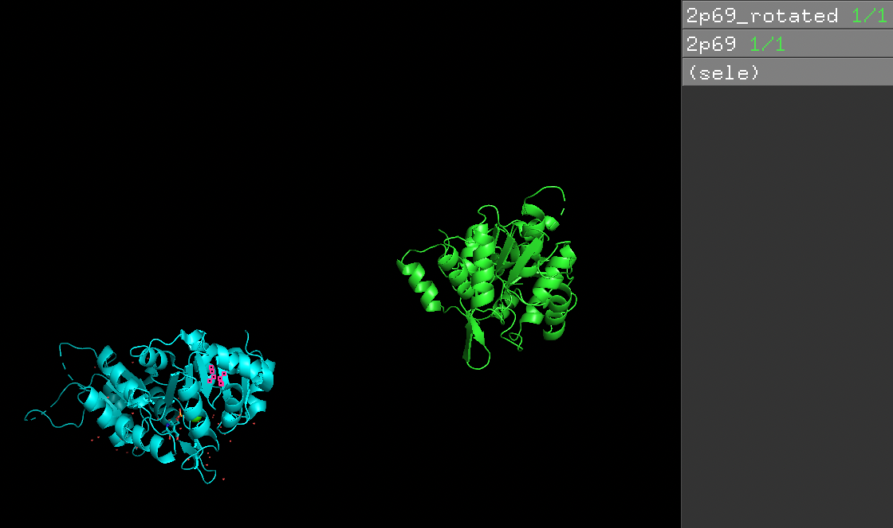

# PDBrotation 
### A simple software for rotating and translating a pdb file

The package provides an utility to rotate and translate a protein data bank (PDB) file. 
One use case of this software is to prepare data needed to evaluate [equidock](https://github.com/octavian-ganea/equidock_public).

## Dependencies 
```
biopandas==0.3.0
numpy==1.22.3
argparse==1.4.0
```

## Installation

```
# download package
git clone https://github.com/wusixer/pdb_rotation.git

# make a virtual env
python -m venv myenv

# activate virtual env
source myenv/bin/activate

# install dependencies within the env
pip install -r requirement.txt
```

## Run software
```
python pdb_rotation.py -pdb ${input_pdb_path} -rotation ${rotation_angle} -out ${out_pdb_path}

```
An example file with test output is placed under `/test_data`. You can see the same pdb is rotated and translated below. 




Note that the rotation is currently performed along the y axis only(assuming the first axis is x, then y, then z). If you want to rotate all 3 axises, make two other variations of `rotation_matrix` in `pdb_rotation.py`, and replace this line 
```
pdb_file.df['ATOM'][['x_coord', 'y_coord', 'z_coord']] = (rotation_matrix @ pdb_file.df['ATOM'][['x_coord', 'y_coord', 'z_coord']].T).T+translation

```
with
```
pdb_file.df['ATOM'][['x_coord', 'y_coord', 'z_coord']] = (rotation_matrix_along_z @ rotation_matrix_along_x @ rotation_matrix_along_y @ pdb_file.df['ATOM'][['x_coord', 'y_coord', 'z_coord']].T).T+translation
```


